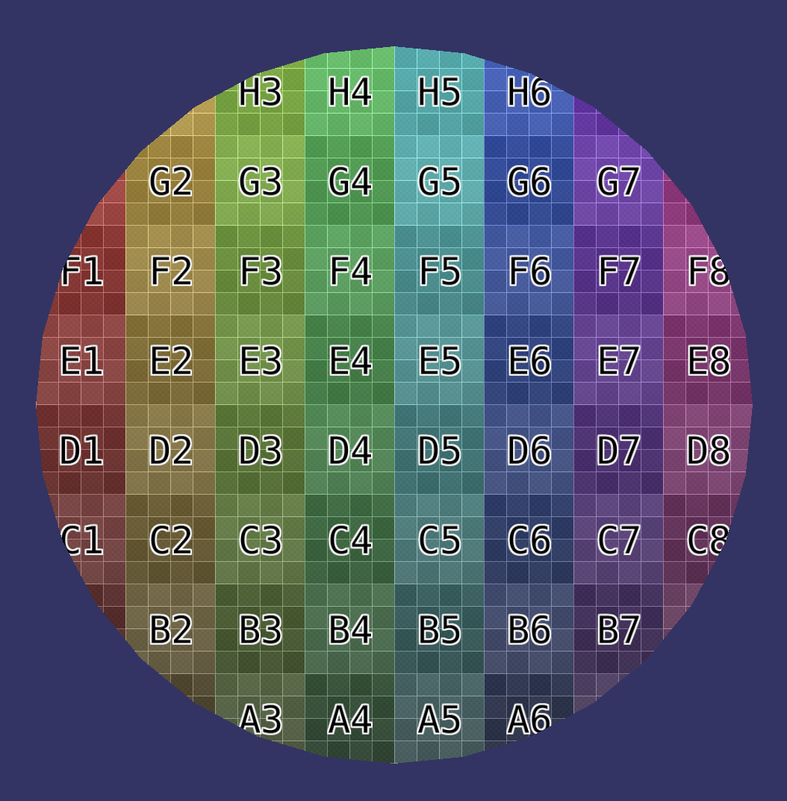
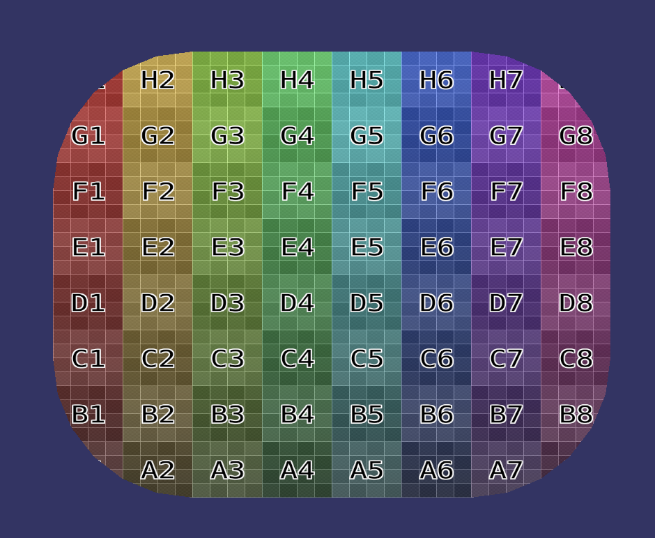
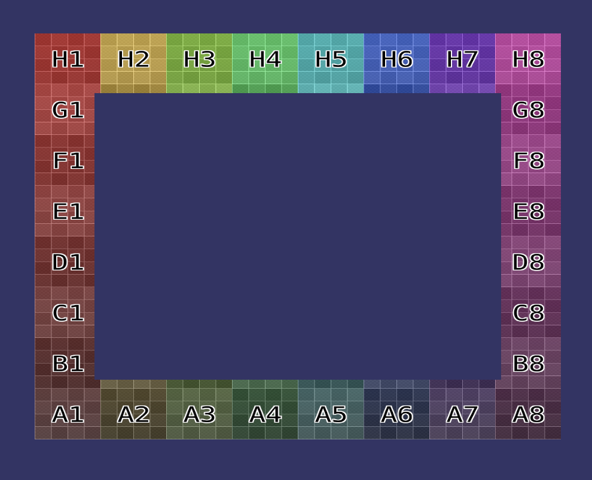

# focus point

To run Focus Point game:

    cargo run --release

# to run examples:

    cargo run --example circle
    cargo run --example rect
    cargo run --example rounded_rect
    cargo run --example stroked_rect

## References

I've been collecting notes on Bevy [here](./BEVY_REFERENCES.md)

## TODO:

- apply puzzle logic from macroquad app
- support resize & full screen => https://github.com/bevyengine/bevy/blob/main/examples/window/scale_factor_override.rs
- refactor large systems into several systems with events between them (ex: hovered tile changed event)
- check if we need to free tile's meshes when we create other ones
- states (menu screen, etc) => https://bevy-cheatbook.github.io/basics/states.html
- optimize change detection => https://bevy-cheatbook.github.io/basics/change-detection.html
- high score?

## Auxiliary work

As part of the development of this game, and anticipating the need for other shapes, created these:
(it's unclear whether one needs to drop the meshes from the mesh resource after they're used)

### circle

- [code](src/shapes/circle.rs)
- [example usage](examples/circle.rs)

### rounded_rect

- [code](src/shapes/rounded_rect.rs)
- [example usage](examples/rounded_rect.rs)

### stroked_rect

- [code](src/shapes/stroked_rect.rs)
- [example usage](examples/stroked_rect.rs)

